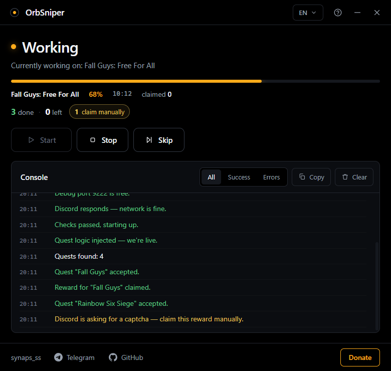
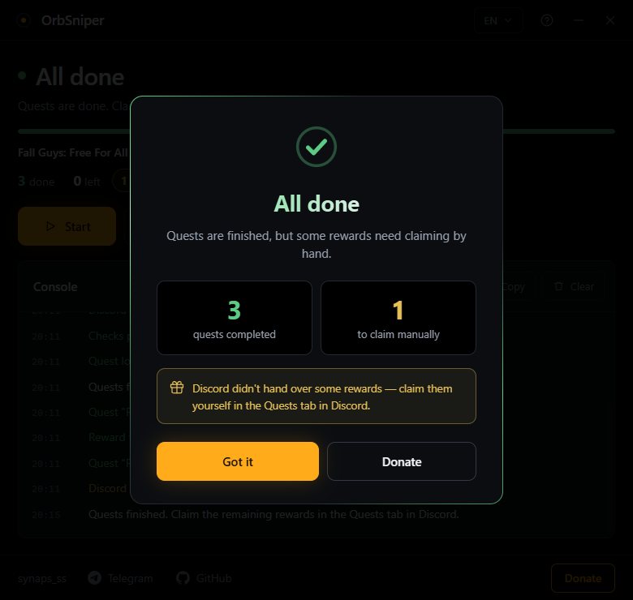
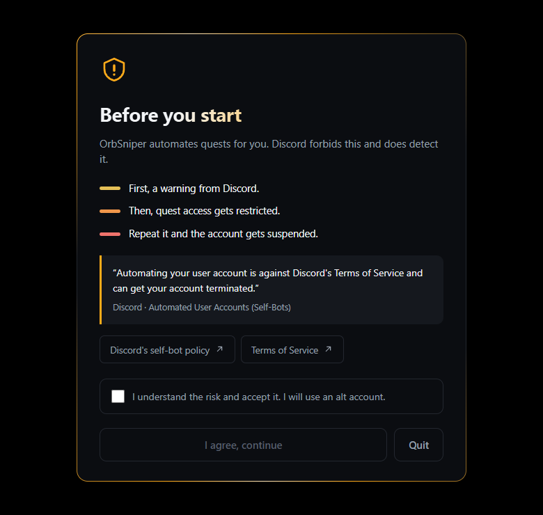

<div align="center">


**English** · [Русский](README.ru.md)

### One dark window, one button

It accepts Discord Quests, completes them and claims the rewards inside your own Discord client.
No token, no game installs, no 500 GB downloads.

[](LICENSE) [](#requirements) [](#) [](#languages) [](../../releases)

[**Download**](../../releases/latest) · [What are Orbs?](#what-are-orbs) · [What it does](#what-it-does) · [FAQ](#faq)

</div>

---

> [!CAUTION]
> **Automating quests breaks Discord's rules.** Since April 2026 it is actively detected: first a warning, then quest access gets restricted, and repeat offences can suspend the account. Use an alt account. All risk is on you. This project exists for educational purposes.
>
> Discord's policy: [Automated User Accounts (Self-Bots)](https://support.discord.com/hc/en-us/articles/115002192352)

> [!IMPORTANT]
> **From Russia you need a VPN.** Discord is blocked there: without a VPN neither the client nor the quest shop will load. Turn the VPN on before you start and keep it on while farming.

## Screenshots

<table>
<tr>
<td width="50%">

<p align="center"><b>Farming</b><br>Live progress, score and a console that speaks plain English</p>
</td>
<td width="50%">

<p align="center"><b>Finished</b><br>Tells you what's done and what's left to claim by hand</p>
</td>
</tr>
</table>

<div align="center">

<p><b>Every launch starts here</b> — the risks, Discord's own policy, and a box you have to tick</p>
</div>

## What are Orbs?

**Orbs are Discord's own currency.** You earn them by completing Quests — those sponsored "play this game for 15 minutes" tasks that show up in your Discord. A typical quest pays around **700 Orbs**, and Nitro subscribers get 250 Orbs a month on top.

What you can spend them on, straight from Discord's shop:

| Reward | Cost |
|---|---|
| **Nitro credit, 3 days** | 1,400 Orbs (≈ two quests) |
| Avatar decorations | varies |
| Profile effects | varies |
| Nameplates | varies |
| Orbs Apprentice badge | 3,500 Orbs spent in the Orbs Exclusives shop |

There are also seven decorations you can **only** get with Orbs — no money buys them.

**The catch:** quests want you to actually install games and sit there for 15–30 minutes each. OrbSniper does that part for you, so the Orbs land in your account while you do something else. Everything stays free — you spend time, not money.

> Orbs can't be used for gifts, partner-branded shop items, a recurring Nitro subscription or Server Boosts.

## What it does

Hit **Start** and the app runs on its own:

- **Checks everything before launching** — is Discord installed, are its settings writable, is the port free, does the network respond. If something's wrong it tells you plainly instead of dying halfway through.
- **Watches for quests** the whole time the window is open — new ones are picked up every 20 seconds.
- **Accepts quests** for you, PC platform selected automatically.
- **Completes them:**
  - `WATCH_VIDEO` / `WATCH_VIDEO_ON_MOBILE` — spoofs watch progress
  - `PLAY_ON_DESKTOP` — reports the game as running (nothing gets installed)
  - `PLAY_ACTIVITY` — sends activity heartbeats
  - `STREAM_ON_DESKTOP` — spoofs stream metadata (may need a real voice-channel stream)
- **Claims rewards** automatically unless Discord asks for a captcha.
- **Skips stuck quests** — by button, or on its own after 3 minutes without progress.
- **Keeps score:** how many quests are done, how many are left, how many rewards you still need to claim by hand.
- **Tells you when everything is finished** — and reminds you about rewards Discord wouldn't hand over.

## The console speaks plain English

No raw engine logs. Instead of `Webpack never became ready` you get "Discord didn't finish loading. Restart it and try again." Errors in red, successes in green, warnings in yellow. Filters, copy and clear included.

## Why no token

OrbSniper never asks for your token and never reads it. Instead it relaunches **your own installed Discord** with a debugging port and injects the quest logic into it. Every request is made by Discord itself from your own session — nothing to leak, nothing to paste anywhere.

## Requirements

- Windows
- Discord desktop app, installed and logged in
- A VPN if you're in Russia
- To run from source: [Node.js 18+](https://nodejs.org/)

## Install

Grab `OrbSniper.exe` from [releases](../../releases/latest) and run it. No Node.js needed.

A risk disclaimer shows on every launch — read it, tick the box, continue.

## Run from source

```bash
git clone https://github.com/syntaxixr/OrbSniper.git
cd OrbSniper
npm install
npm start
```

## Build the exe

```bash
npm run dist
```

or just run `build.bat`. You get:

- `dist\OrbSniper.exe` — single portable file, fine for a USB stick. Takes ~8 seconds to start: it unpacks itself into a temp folder every time.
- `dist\win-unpacked\` — the unpacked build. Starts in under a second. Copy the folder anywhere and make a shortcut to `OrbSniper.exe`.

## Controls

| Button | What it does |
|---|---|
| **Start** | Runs the checks, relaunches Discord, injects the logic, starts farming |
| **Stop** | Ends everything immediately. Discord stays open |
| **Skip** | Drops the current quest and moves to the next one |
| **Fix and restart** | Appears when something breaks. Force-closes every Discord process, frees the debug port and starts over |
| **?** | Instructions, FAQ and warnings |

Close the window and farming stops. Discord keeps running.

## Languages

English, Русский, 中文, Español, Português, Deutsch, Français, Polski, Türkçe, Українська.

The language is picked from your system on first launch, then your choice is remembered.

## FAQ

**A quest is stuck at 0% — why?**
Discord validates stream quests on its side: they need a real stream in a voice channel. After 3 minutes without progress the quest is skipped automatically.

**Is my token safe?**
Your token is never read, stored or sent anywhere. Every request comes from inside your own Discord client.

**Do I have to accept quests manually?**
No. If Discord throws a captcha at acceptance or when claiming, the app says so — handle that one by hand, the rest keep farming.

**Do Vencord / BetterDiscord conflict?**
No, they work fine alongside it.

**Nothing starts, red error about the network.**
Discord is unreachable. Turn on a VPN and try again.

**It worked for my friend but not for me.**
Usually a leftover Discord process holding the debug port. Press **Fix and restart** — it force-closes everything, frees the port and retries. If the console says the port is held by something that isn't Discord, close that program first.

**Will this get me banned?**
It can. Discord detects quest automation and punishes it — warning, quest restrictions, up to suspension. Use an account you can afford to lose.

## Author

<div align="center">

### Made by **synaps_ss**

[](https://t.me/synaps_ss)
[](https://github.com/syntaxixr)

**Idea, code, design and translations — all original work.**

Questions, bugs, ideas: [@synaps_ss](https://t.me/synaps_ss) on Telegram

</div>

## Terms of use

Free and open source under [MIT](LICENSE). Use it, study it, change it for yourself — all allowed. But one human request:

> [!IMPORTANT]
> ### 🚫 Don't re-upload this as your own
>
> If you post OrbSniper anywhere else — forums, Telegram channels, file hosts, roundups, videos — **credit the author and link the original:**
>
> - **Author:** synaps_ss — Telegram [@synaps_ss](https://t.me/synaps_ss)
> - **Original:** https://github.com/syntaxixr/OrbSniper
>
> This isn't a whim: the MIT licence explicitly requires keeping the copyright notice in every copy and derivative work. Publishing it under your own name, stripping the copyright or selling it breaks the licence.
>
> Want to improve it? Fork it or open a pull request — that way everyone sees your changes and the author stays the author.

**Fine, no questions asked:** using it, forking with credit intact, changing the code for yourself, sending friends a link to this repo.

**Please don't:** re-upload it as your own work, strip mentions of the author, sell it, or ship your own builds without linking the original.

## 💸 Support the author

The project is free and will stay that way. If OrbSniper saved you time and farmed you some Orbs, you can thank the author with a coin. Not required, but very much appreciated.

<div align="center">

### USDT · TRON network (TRC20)

```
TJXGAkovUoA2z9C7mWBiB9SGLVQu6oSsf
```


**Scan the QR with any wallet**

⚠️ **TRC20 (TRON) only.** Send it through another network and the money is gone for good.

No crypto but still want to help? Star the repo and tell your friends — that counts too.

</div>

## Disclaimer

OrbSniper is not affiliated with or endorsed by Discord Inc. Automating quests breaks Discord's rules — by using this project you accept every risk yourself. The author is not responsible for account suspensions, lost progress or any other consequence. Built for educational purposes.

---

<div align="center">

**MIT** · © 2026 synaps_ss · [Русская версия](README.ru.md)

</div>
