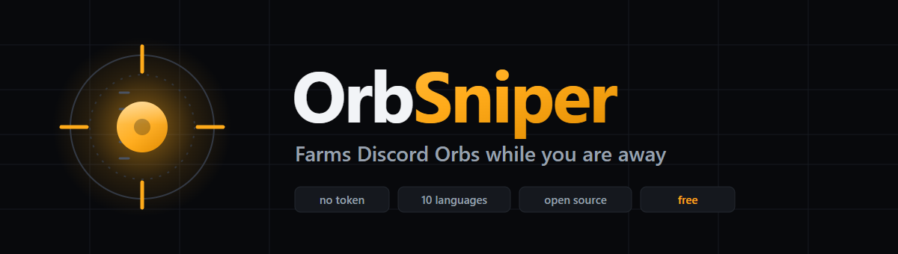
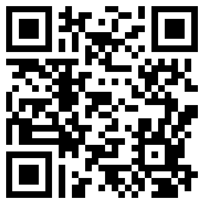

<div align="center">



**Русский** · [English](README.md)

### Тёмное окно, одна кнопка

Принимает квесты, докручивает их и забирает награды прямо в твоём Discord.
Без токена, без установки игр, без 500 ГБ загрузок.

[**Скачать**](../../releases/latest) · [Что такое Orbs?](#что-такое-orbs) · [Что делает](#что-делает) · [Вопросы](#вопросы)

[](LICENSE) [](#что-нужно) [](#) [](#языки) [](../../releases)

</div>

---

> [!CAUTION]
> **Автоматизация квестов нарушает правила Discord.** С апреля 2026 её активно ловят: сначала предупреждение, потом закрывают доступ к квестам, при повторах — блокировка аккаунта. Гоняй на запасном аккаунте. Ответственность полностью на тебе. Проект сделан в образовательных целях.
>
> Правило Discord: [Automated User Accounts (Self-Bots)](https://support.discord.com/hc/ru/articles/115002192352)

> [!IMPORTANT]
> **Из России — только с VPN.** Discord в России заблокирован: без VPN не откроется ни клиент, ни магазин с квестами и орбами. Включи VPN до запуска и не выключай, пока идёт фарм.

## Что такое Orbs

**Orbs — внутренняя валюта Discord.** Их дают за выполнение квестов — тех самых спонсорских заданий вида «поиграй в эту игру 15 минут», которые появляются в твоём Discord. За обычный квест платят около **700 орбов**, подписчикам Nitro капает ещё 250 орбов в месяц.

Что на них можно взять прямо в магазине Discord:

| Награда | Цена |
|---|---|
| **Nitro на 3 дня** | 1 400 орбов (≈ два квеста) |
| Украшения аватара | по-разному |
| Эффекты профиля | по-разному |
| Таблички имени | по-разному |
| Значок Orbs Apprentice | 3 500 орбов, потраченных в разделе Orbs Exclusives |

Плюс семь украшений, которые **только** за орбы и берутся — за деньги их не купить.

**Загвоздка:** квесты требуют реально ставить игры и сидеть в них по 15–30 минут каждый. OrbSniper делает это за тебя — орбы капают, пока ты занимаешься своими делами. Всё бесплатно: тратишь время, а не деньги.

> За орбы нельзя купить подарки, партнёрские товары, обычную подписку Nitro и бусты сервера.

## Что делает

Жмёшь **Начать** — и дальше приложение работает само:

- **Проверяет всё перед стартом** — есть ли Discord, пишутся ли настройки, свободен ли порт, отвечает ли сеть. Что не так — скажет прямо, а не упадёт посреди процесса.
- **Следит за квестами** круглосуточно, пока окно открыто — новые подхватывает каждые 20 секунд.
- **Принимает квесты** сам, платформа PC выбирается автоматически.
- **Докручивает их:**
  - `WATCH_VIDEO` / `WATCH_VIDEO_ON_MOBILE` — подделывает прогресс просмотра
  - `PLAY_ON_DESKTOP` — выдаёт игру за запущенную (устанавливать ничего не нужно)
  - `PLAY_ACTIVITY` — шлёт heartbeat активности
  - `STREAM_ON_DESKTOP` — подделывает метаданные стрима (может потребоваться реальный стрим в голосовом канале)
- **Забирает награды** автоматически, если Discord не требует капчу.
- **Пропускает застрявшие** — вручную кнопкой или само через 3 минуты без прогресса.
- **Показывает счёт:** сколько выполнено, сколько осталось, сколько наград нужно забрать самому.
- **В конце говорит, что всё готово** — и напоминает забрать награды, которые Discord не отдал сам.

## Консоль говорит по-человечески

Никаких сырых английских логов. Вместо `Webpack never became ready` — «Discord не успел загрузиться. Перезапусти его и попробуй снова». Ошибки красным, успех зелёным, предупреждения жёлтым. Есть фильтры, копирование и очистка.

## Почему не нужен токен

OrbSniper не спрашивает токен и никогда его не читает. Вместо этого он перезапускает **твой собственный установленный Discord** с портом отладки и впрыскивает логику квестов внутрь. Все запросы делает сам Discord из твоей сессии — утекать нечему, вставлять никуда ничего не надо.

## Что нужно

- Windows
- Discord (десктопное приложение), установленный и с выполненным входом
- VPN, если ты в России
- Для запуска из исходников: [Node.js 18+](https://nodejs.org/)

## Установка

Скачай `OrbSniper.exe` из [релизов](../../releases) и запусти. Node.js на машине не нужен.

При первом запуске появится экран ознакомления с рисками — прочитай, поставь галочку, и он больше не покажется.

## Запуск из исходников

```bash
git clone https://github.com/syntaxixr/OrbSniper.git
cd OrbSniper
npm install
npm start
```

## Сборка exe

```bash
npm run dist
```

или просто запусти `build.bat`. Результат:

- `dist\OrbSniper.exe` — портативный файл, один экземпляр, можно носить на флешке. Запускается ~8 секунд: распаковывает себя во временную папку.
- `dist\win-unpacked\` — распакованная сборка. Запускается меньше чем за секунду. Скопируй папку куда угодно и сделай ярлык на `OrbSniper.exe`.

## Управление

| Кнопка | Что делает |
|---|---|
| **Начать** | Проверяет условия, перезапускает Discord, впрыскивает логику, начинает фарм |
| **Стоп** | Прекращает всё немедленно. Discord остаётся открытым |
| **Пропустить** | Бросает текущий квест и переходит к следующему |
| **?** | Инструкция, FAQ и предупреждения |

Закрыл окно — фарм остановился. Discord продолжит работать.

## Языки

Русский, English, 中文, Español, Português, Deutsch, Français, Polski, Türkçe, Українська.

Язык определяется по системе при первом запуске, дальше запоминается выбор.

## Вопросы

**Квест висит на 0% — почему?**
Стрим-квесты Discord проверяет на своей стороне: нужен настоящий стрим в голосовом канале. Через 3 минуты без прогресса квест пропускается сам.

**Токен в безопасности?**
Токен не читается, не хранится и никуда не отправляется. Все запросы идут изнутри твоего собственного Discord.

**Нужно ли принимать квесты вручную?**
Нет. Если Discord потребует капчу при приёме или выдаче награды, приложение скажет об этом — такой квест забери руками, остальные продолжат фармиться.

**Vencord / BetterDiscord мешают?**
Нет, конфликтов нет.

**Ничего не запускается, красная ошибка про сеть.**
Значит Discord недоступен. Включи VPN и попробуй снова.

## Автор

<div align="center">

### Проект сделал **synaps_ss**

[](https://t.me/synaps_ss)
[](https://github.com/syntaxixr)

**Идея, код, дизайн, переводы — целиком авторская работа.**

По любым вопросам, багам и предложениям пиши в Telegram: [@synaps_ss](https://t.me/synaps_ss)

</div>

## Правила использования

Проект бесплатный и с открытым кодом под [MIT](LICENSE). Пользуйся, изучай, меняй под себя — всё это разрешено. Но по-человечески прошу:

> [!IMPORTANT]
> ### 🚫 Не перезаливайте проект как свой
>
> Если выкладываете OrbSniper где-то ещё — на форумах, в Telegram-каналах, на файлообменниках, в подборках, в видео — **обязательно указывайте автора и ссылку на оригинал:**
>
> - **Автор:** synaps_ss — Telegram [@synaps_ss](https://t.me/synaps_ss)
> - **Оригинал:** https://github.com/syntaxixr/OrbSniper
>
> Это не прихоть: лицензия MIT прямо требует сохранять указание авторства в любых копиях и производных работах. Выложить под своим именем, стереть копирайт или продать — нарушение лицензии.
>
> Хочешь доработать? Лучше сделай форк или пришли pull request — так изменения увидят все, а автор останется автором.

**Что можно без вопросов:** пользоваться, форкать с сохранением авторства, менять код под себя, кидать друзьям ссылку на этот репозиторий.

**Что просьба не делать:** перезаливать как свою работу, вырезать упоминания автора, продавать, собирать свои сборки без ссылки на оригинал.

## 💸 Поддержать автора

Проект бесплатный и таким останется. Если OrbSniper сэкономил тебе время и нафармил орбов — можешь поблагодарить автора монетой. Это не обязательно, но очень приятно.

<div align="center">

### USDT · сеть TRON (TRC20)

```
TJXGAkovUoA2z9C7mWBiB9SGLVQu6oSsf
```



**Сканируй QR любым кошельком**

⚠️ Только сеть **TRC20 (TRON)**. Отправишь через другую сеть — деньги потеряются безвозвратно.

Нет крипты, но хочешь поддержать? Поставь ⭐ репозиторию и расскажи друзьям — это тоже помогает.

</div>

## Отказ от ответственности

OrbSniper никак не связан с Discord Inc. и не одобрен ею. Автоматизация квестов нарушает правила Discord — используя проект, ты берёшь все риски на себя. Автор не несёт ответственности за блокировки аккаунтов, потерянный прогресс или любые другие последствия. Проект создан в образовательных целях.

---

<div align="center">

**MIT** · © 2026 synaps_ss · [English version](README.md)

</div>
